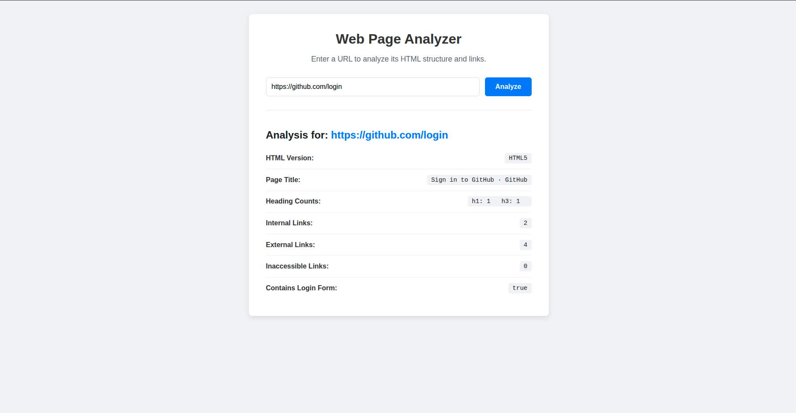
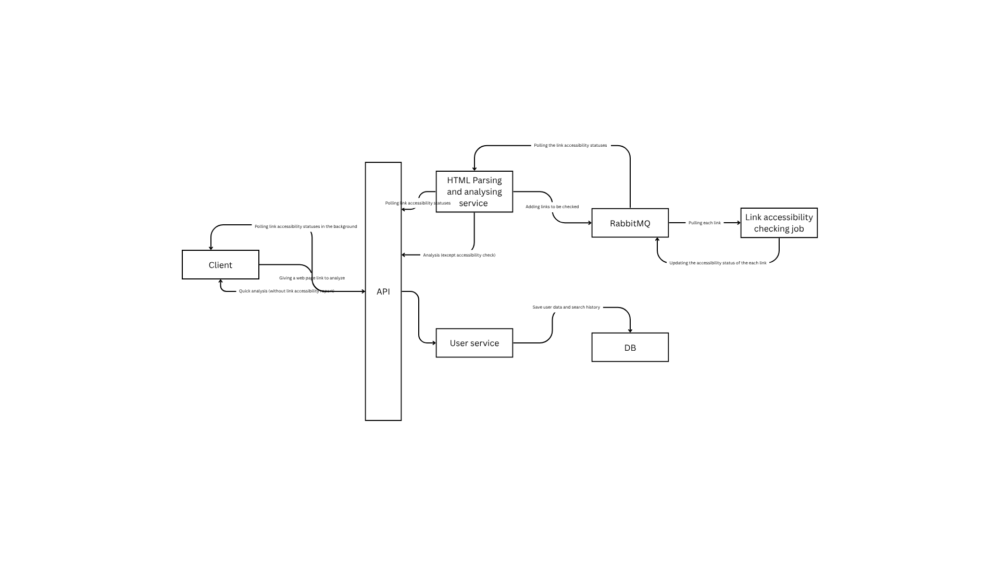

# Web Analyzer

[](https://goreportcard.com/report/github.com/lalithyawiki/web-analyzer)
[](https://opensource.org/licenses/MIT)
[](https://golang.org)
[](https://github.com/lalithyawiki/web-analyzer/issues)
[](https://github.com/lalithyawiki/web-analyzer/network/members)
[](https://github.com/lalithyawiki/web-analyzer/stargazers)

An efficient and powerful tool to analyze web pages, built with Go. This project provides a detailed analysis of a given URL, including its HTML structure, SEO metrics, and more.

## Table of Contents

- [About The Project](#about-the-project)
  - [Built With](#built-with)
- [Getting Started](#getting-started)
  - [Prerequisites](#prerequisites)
  - [Installation](#installation)
- [Usage](#usage)
- [Docker](#docker)
- [Project Structure](#project-structure)
- [Testing](#testing)
- [Challenges, Assumptions and Learnings](#challenges-assumptions-and-learnings)
- [Roadmap](#roadmap)
- [Contributing](#contributing)
- [Code of Conduct](#code-of-conduct)
- [License](#license)
- [Contact](#contact)
- [Acknowledgements](#acknowledgements)

## About The Project

Web Analyzer is a tool with a web interface that allows you to get a comprehensive analysis of any website. It's built with Go for performance and provides a clean and easy-to-understand report.

This tool is perfect for:
* Web developers who want to quickly inspect the technical details of a webpage.
* SEO specialists looking to analyze on-page SEO factors.
* Anyone curious about the inner workings of a website.

### Built With

This project is built with the following technologies:

* [Go](https://golang.org/)
* Standard HTML/CSS/JS for the UI
* [goquery](https://github.com/PuerkitoBio/goquery)
* [Docker](https://www.docker.com/)
* [make](https://www.make.com/)

## Getting Started

To get a local copy up and running, follow these simple steps.

### Prerequisites

Make sure you have the following installed:
* [Go](https://golang.org/dl/) (version 1.18 or higher)
* [Docker](https://www.docker.com/get-started) (optional, for containerized deployment)

### Installation

1.  Clone the repo
    ```sh
    git clone [https://github.com/lalithyawiki/web-analyzer.git](https://github.com/lalithyawiki/web-analyzer.git)
    ```
2.  Navigate to the project directory
    ```sh
    cd web-analyzer
    ```
3.  Build the application
    ```sh
    go build -o ./cmd/web-analyzer ./cmd
    ```

## Usage

You can use Web Analyzer directly from the command line.

**To start the web interface:**
```sh
cd ./cmd
```
```sh
./web-analyzer
```
This will start a local web server (by default on port 8080). You can then open your browser to `http://localhost:8080` to use the web-based UI.

### Web Interface Screenshot



## Docker

You can also run the application using Docker.

1.  Build the Docker image:
    ```sh
    docker build -t web-analyzer .
    ```
2.  Run the container:
    ```sh
    docker run -p 8080:8080 web-analyzer
    ```

## Testing

You can also run the application using Docker.

Run all unit tests:
```sh
make test
```
or run this in the root folder
```sh
go test -v ./...
```

See the unit test coverage:
```sh
make coverage
```
or run this in the root folder
```sh
go test -coverprofile=coverage.out ./...
```

## Project Structure

```
.
├── cmd/                 # Main application entry point
├── internal/            # Private application and library code
│   └── analyzer/        # Core analysis logic
├── ui/                  # Web interface files (HTML, CSS)
├── .gitignore
├── Dockerfile
├── go.mod
├── go.sum
└── LICENSE
└── Makefile
```

## Challenges, Assumptions and Learnings

This project was a great learning experience. Here are some of the key challenges I encountered and how I overcame them:

* **Challenge: Deciding app architecture**
    * **Problem:** Which architecture to be chosen
    * **Solution:** I assumed this application is built for a startup. Therefore, I went with a simple solution first. In this way I can add more value to the core product with the limited time I got. Based on the scalability requirements and the resources we got we can improve the application architecture accordinglly in the future.   For this reason I went with a monalithic application with clear boundaries like ui, cmd and internal structure. For an example if it is needed in the future we can move ui code to a framework like `React` easily and rest of the code can be kept in the backend by exposing an API to the client.  

* **Challenge: Parsing Complex HTML Structures**
    * **Problem:** Selecting the most suitable way to parse html
    * **Solution:** I had to select most simple, powerful and less time consuming way to parse the html since I had to manage the limited time I got to implement this. I tried Go's `net/html` package initially.  Even though it was really powerful it was adding more complexities to the code. I decided to go for a wrapper around this package to achieve my goal with the time I got. Therefore, I went with `goquery`. Since it had a good community and simple interface, it was easy to learn and implement. 

* **Challenge: Handling concurrency**
    * **Problem:** Making link accessibility check faster
    * **Solution:** Initially I had a synchrous synchronous way of executing for accessibility check. However, it works fine if there are very limited number of web urls. It is not guranteed that how much links we are getting. The response times go really high due to that. Therefore, I learned about Go routines, channels and worker groups. Then I implemented a model that works concurrently when checking the links. Response times were dropped due to this. <br /> I created a go routine for each link in the page to check its accessibility initially. But then I realized if a web page has thousands of links and if we create a go routine for each link it will be a huge impact on the processor and this can lead for app crashes since it is very unpredictable. <br /> Therefore, I created a worker pool. Number of workers can be configured. Only that amount of worker go routines will check the links for the accessibility. This approach stops all the issues I mentioned before. 

## Roadmap

Here are some ideas for future improvements:

- [ ] **Integrate https:** This is the first thing we need to do as the next step to make the app more secure for use.
- [ ] **Support user accounts:** This will help us to understand the users and their app usage patterns.
- [ ] **Historical Analysis:** Allow users to save analysis and compare them over time.
- [ ] **Change the architecture based on the scalability requirements:** Proposed architecture is shown below
- [ ] **Integrate tool to track app matrics:** Currently we are using extensive logs to track what is happening with the app. But it is better to introduce a tool like datadog or promethious.
- [ ] **Test plan:** Creating a plan about how to test different functions using different testing methods and test percentages to maintain is important. Running tests in the dev pipeline is equally important.
- [ ] **CI/CD:** Creating a proper CI/CD pipeline by integrating code quality gates like SonarCube is better.
- [ ] **Accessibility Analysis:** Integrate checks for WCAG compliance.
- [ ] **Performance Metrics:** Include detailed performance scores, similar to Google Lighthouse.
- [ ] **Technology Stack Detection:** Identify frameworks and libraries used on a page.
- [ ] **Export Reports:** Add functionality to export the analysis to PDF or JSON.

### Proposed Architecture


## Acknowledgements

* [Go Team](https://golang.org/)
* [README Template by Othneil Drew](https://github.com/othneildrew/Best-README-Template)
